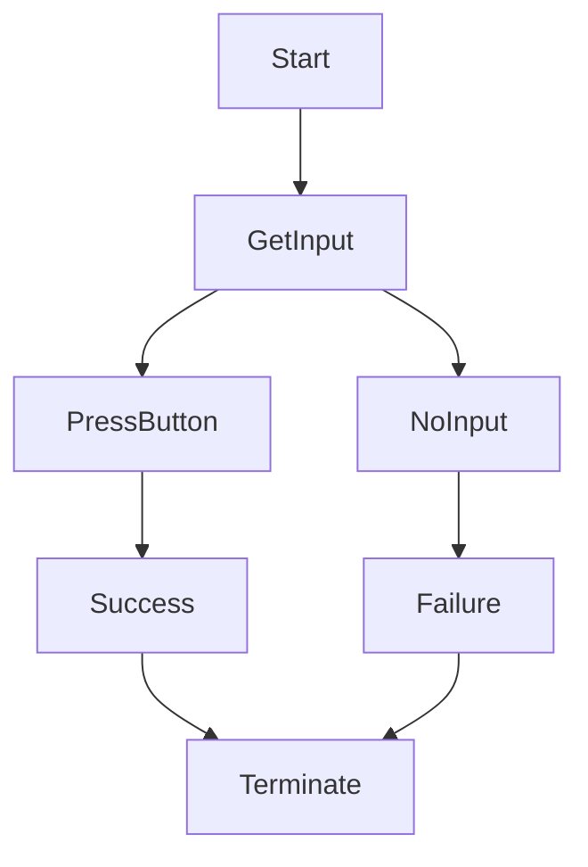

Imports required:
  Main components: Screen, joystick, buttons
  - #include <TFT_eSPI.h> for the screen
  - none required for the joystick or buttons
  /nExtra components: Pixel screen, lights, sound, rfid*
  -for pixel screen: #include <LiquidCrystal.h>

Incremental program:
1. Beginning Logic:
  Start game for time period - press button to begin
  Timer for 10 secs
  if user presses down on joystick = sucess, terminate
  else if time interval ends before input, terminate, then note fail
2. Next step:
  Moving dot to get across screen in time interval
3. Next:
  moving dot avoinding obstacles
  

